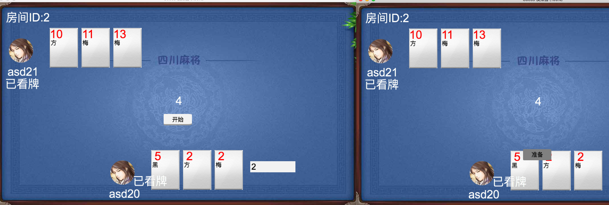

# 扎金花(cccGame)
*   一款扎金花游戏  客户端是 cocos creator <=1.5.2  服务器是pomelo
    改代码详解 见 http://blog.sina.com.cn/s/articlelist_2808783193_14_1.html

# 运行

## 客户端
*   cocos creator 1.5.0

## 服务器
`1 pomelo node 4.5.0 + mysql`

`2 cccGame/assets/resources/data/protocol.json  内修改 http地址 为服务器地址`

`3 server/game-server/app/consts/consts.js  修改host地址 为服务器地址`

`4 导入 game-server/app/tools/mysql/cccGame.sql`

`5 配置  server/game-server/mysql.json 为自己 mysql 账户密码`

# 效果

#   技术讨论群
*   275348123

